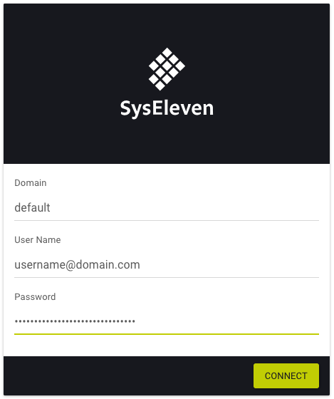
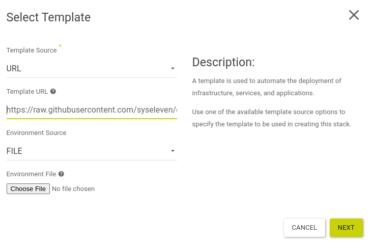
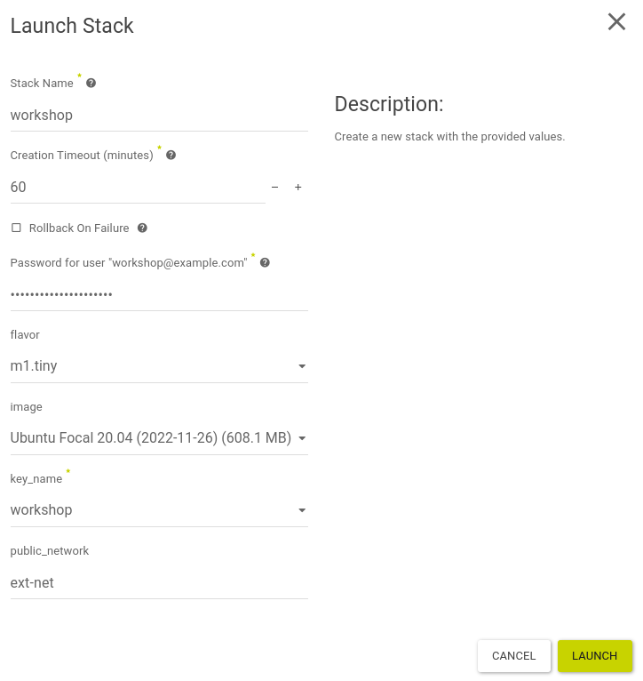

# Erster Login in Openstack und Jumphost

## Übersicht

Mit dieser Anleitung kannst Du eine einzelne Instance mit einem vorinstallierten 
Openstack Client über das Horizon Dashboard (GUI) erstellen.

Dieser "Jumphost" enthält alle erforderlichen Tools, um mit Openstack zu beginnen.

## Ziel

* erstelle eine Jumphost Instance via Horizon (GUI)
* automatisierte Installation des Openstack Clients in der neuen Instance

## Vorbereitung

* Du brauchst die Login Daten für Openstack (Benutzer und Passwort)
* grundlegende Kenntnisse zum Umgang mit einem Linux Terminal und SSH

---

### Login

* Rufe die URL https://cloud.syseleven.de im Browser auf

* melde dich mit deinen Zugangsdaten an
  * Domain: `default`
  * User Name: `<Benutzername>`
  * Password: `<Passwort>`
* Klick auf "CONNECT"

### Region auswählen

* Überprüfe zunächst in welcher Region Du angemeldet bist und wechsle ggf. auf die richtige Region

### Heat Stack starten

* Klicke auf "Project" --> "Orchestration" --> "Stacks" um den Beispiel-Stack in Horizon zu erstellen

* Klick auf "Launch Stack"

* Wähle `URL` als **Template Source** aus
* Kopiere die URL des Beispiel-Stacks `https://raw.githubusercontent.com/syseleven/openstack-workshop-lab/main/01-erster-login/kickstart.yaml`
* und füge sie in das Feld **Template URL** ein
* Wähle `File` als **Environment Source**
* Klick auf **NEXT**
---

* trage in das Feld **Stack Name** den Namen `workshop` ein
* trage dein Openstack Password in das Feld **Password for User ...** ein
* **flavor:** wähle den Flavor `m1.tiny` aus
* **image:** wähle ein beliebiges `Ubuntu Focal 20.04 (...)` Image aus
* **key_name:** wähle den bereits vorhandenen SSH-Key `...-workshop` aus
* Klick auf "LAUNCH"

---

### Überprüfen und Verbinden

* Daraufhin ist der Stack im Status **Create In Progress** oder **Create Complete**
* Klick auf **Compute** --> **Instances**
* beachte die **Floating IP** in der Spalte **IP Address** deiner neuen Instance
* öffne ein Terminal deiner Wahl und log dich via SSH mit dem Benutzernamen `syseleven` in deine Instance ein:
`ssh syseleven@<Floating IP> -i ~/.ssh/<private SSH key>`
