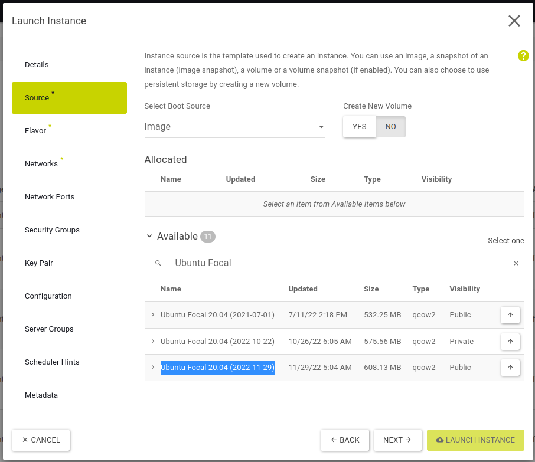
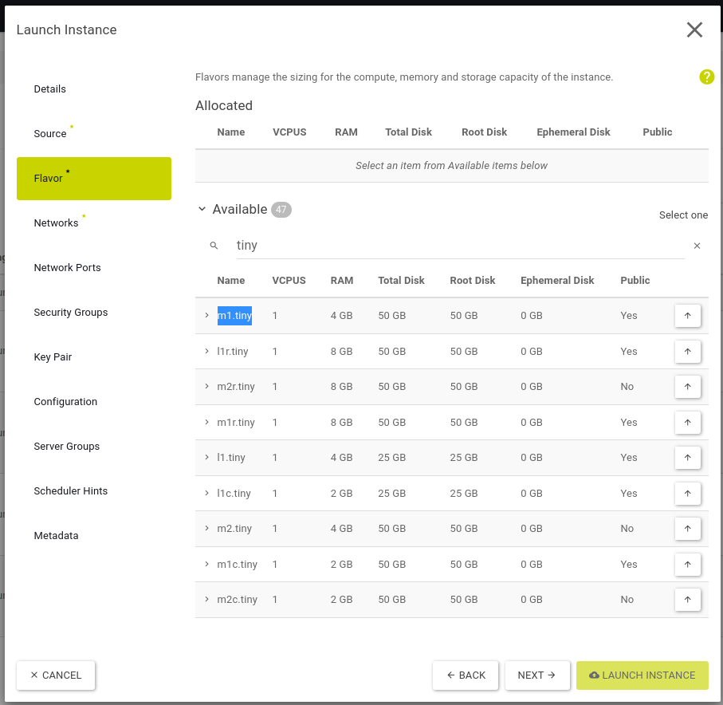
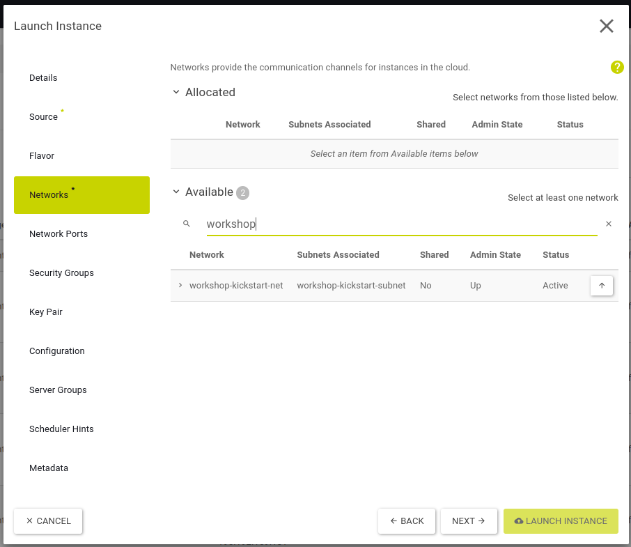
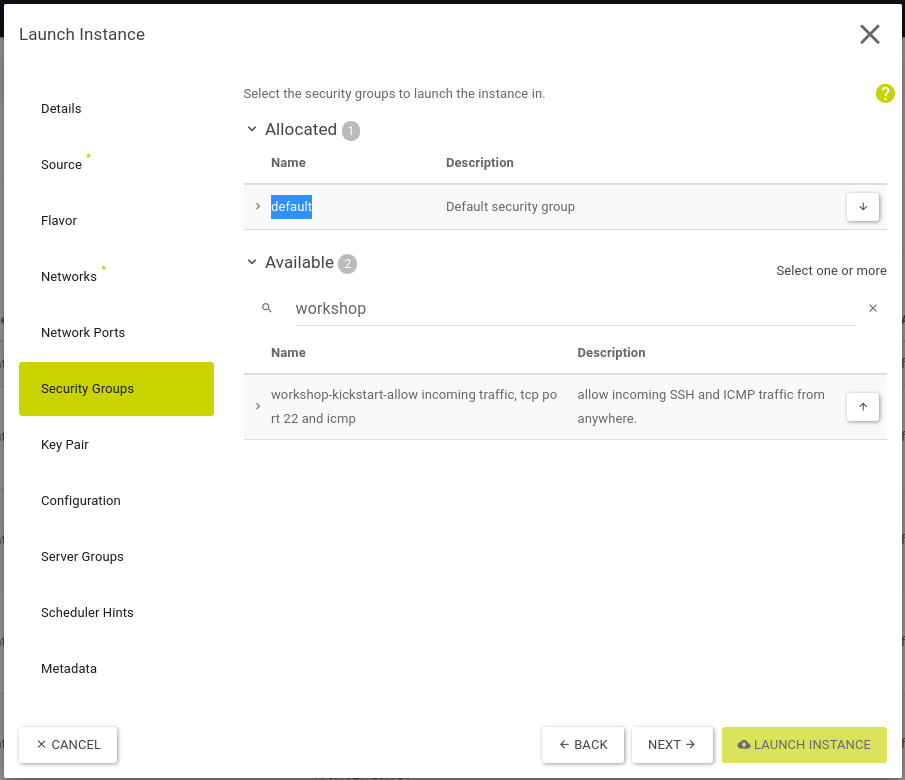
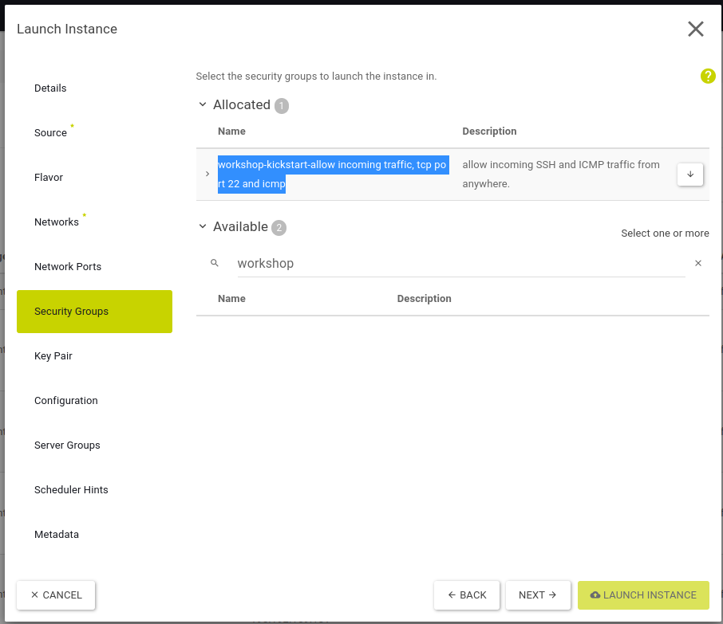
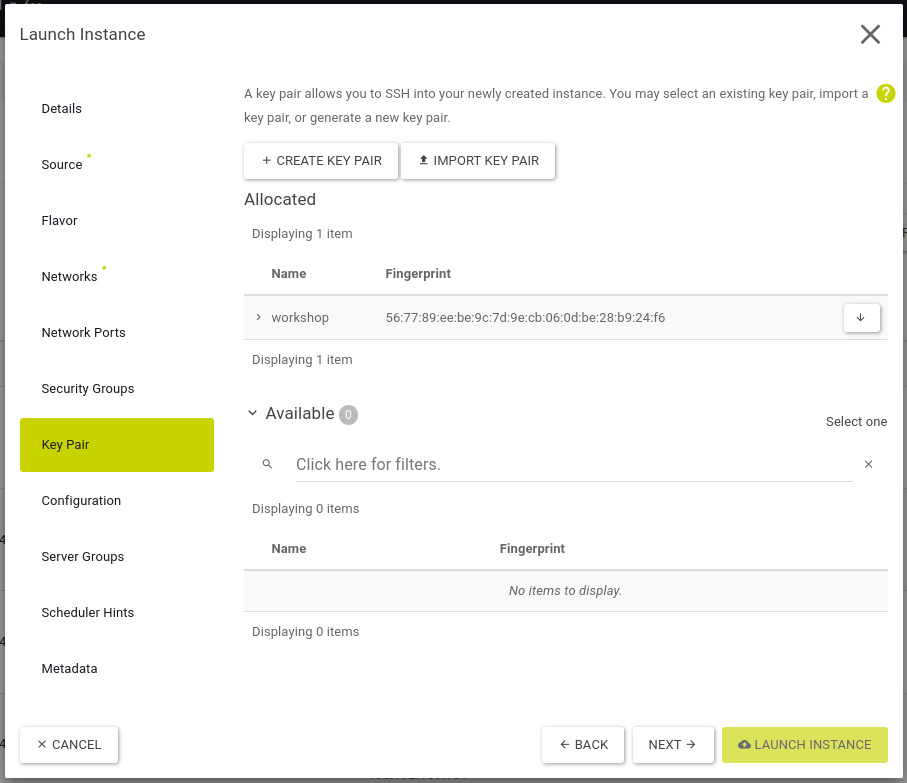

# Erstellen einer Instance über das Horizon Web UI

## Übersicht

Mit dieser Anleitung kannst Du eine einzelne Instance per Horizon Web UI erstellen.

## Ziel

* Erstelle eine Instance mittels Horizon Web UI

## Vorbereitung

* Du brauchst die Login Daten für OpenStack
  * Benutzername
  * Passwort
  * Project ID
  * Region Name
* Bereits installierte Infrastruktur aus Aufgabe [01-erster-login-und-jumphost](/01-erster-login-und-jumphost)

---

## Start

* Log dich auf https://cloud.syseleven.de in die Horizon Web UI mit deinen Zugangsdaten ein

* überprüfe deine aktuelle Region und wechsle ggf. auf die korrekte Region

---

## Erstellen der Instance

* Klicke auf **Project** --> **Compute** --> **Instances**
* Klicke auf den Button **LAUNCH INSTANCE**

---

* Trage `server-horizon` als **Instance Name** und
* optional eine Beschreibung unter **Description** ein
* wähle den Namen der dir zugewiesenen **Region** als **Availability Zone** aus und
* belasse den **Count** auf `1`
* klicke dann auf **NEXT**

---

* belasse die folgenden Einstellungen unverändert:

* **Select Boot Source**: `Image`
* **Create New Volume**: `NO`

* Wähle nun aus der Liste der verfügbaren Betriebssystem Images ein beliebiges `Ubuntu Focal (...)` aus und aktiviere es
per Klick auf den Pfeil (nach oben)
* Klicke nun auf **NEXT**

---

* wähle aus der Liste der Flavors `m1.tiny` aus und aktiviere es per Klick auf den Pfeil (nach oben)
* Klicke nun auf **NEXT**

---

* wähle aus der Liste das in Aufgabe [01-erster-login-und-jumphost](/01-erster-login-und-jumphost) 
erstellte Netzwerk `workshop-kickstart-net` aus und 
* aktiviere es per Klick auf den Pfeil (nach oben)
* Klicke nun auf **NEXT**

---

* der Bereich **Network Ports** muss in diesem Beispiel nicht konfiguriert werden,
* klicke daher einfach auf **NEXT**

---

* entferne die **Security Group** `default` per Klick auf den Pfeil (nach unten)

* aktiviere die vorhandene **Security Group** `workshop-kickstart-allow ...` per Klick auf den Pfeil (nach oben)
* Klicke nun auf **NEXT**

---

* wähle das vorhandene Key Pair `workshop` aus und
* aktiviere es per Klick auf den Pfeil (nach oben)
* die übrigen Einstellungsmenüs sind für dieses Beispiel nicht erforderlich,
* klicke darum gleich abschließend auf **LAUNCH INSTANCE**

---

### Was fällt auf?

* die Instance hat keine public IP

### Weitere Aufgaben

* lasse die Instance in Horizon anzeigen und notiere ihre IP-Adresse
* überprüfe die Instance in der Network Topology
* log dich vom Jumphost aus auf der Instance ein

`ssh ubuntu@<Instance-IP>`

* warum ist der Benutzername hier `ubuntu`?
