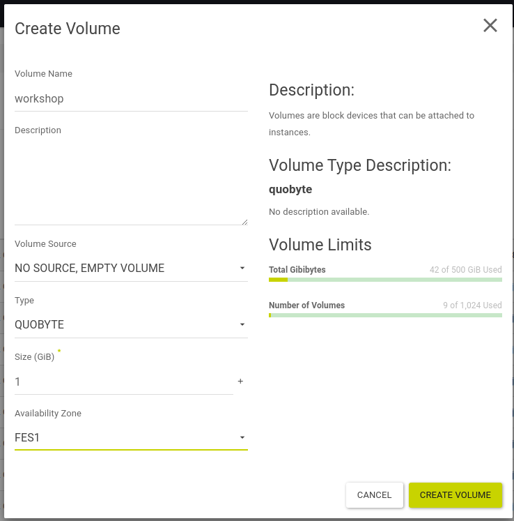
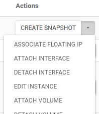
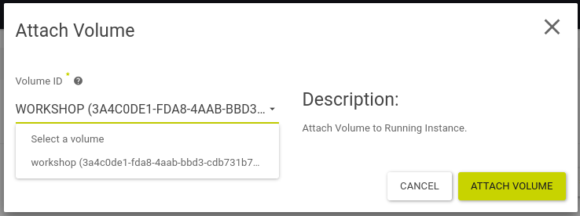

# Erstellen und Mounten eines Volumes per Horizon

## Übersicht

Mit dieser Anleitung kannst Du Volumes per Horizon Web UI erstellen und in einer Instance mounten.

## Ziel

* Erstelle eine Volume mittels Horizon Web UI
* erstelle ein Filesystem auf dem Volume
* mounte das Volume in einer Instance

## Vorbereitung

* Du brauchst die Login Daten für Openstack
  * Benutzername
  * Passwort
  * Project ID
  * Region Name
* Bereits installierte Instance aus Aufgabe [02-instance-per-horizon](/02-instance-per-horizon)

---

## Start

* Log dich auf https://cloud.syseleven.de in die Horizon Web UI mit deinen Zugangsdaten ein


* überprüfe deine aktuelle Region und wechsle ggf. auf die korrekte Region


---

### Volume erstellen

* Klicke auf **Project** --> **Volumes** --> **Volumes**
* klicke auf den Button **CREATE VOLUME**


* trage unter **Volume Name** `workshop` als Bezeichnung ein
* optional kann eine **Description** eingetragen werden
* wähle als **Volume Source** `NO SOURCE, EMPTY VOLUME` aus
* setze den **Type** auf `QUOBYTE`
* trage eine **Size (GiB)** von `1` ein
* wähle unter **Availability Zone** die dir zugewiesene **Region** aus
* klicke abschließend auf **CREATE VOLUME**



---

* das Volume wird nun erstellt und wird in der Liste der Volumes angezeigt


#### Was fällt auf?

* das Volume ist "available", da es noch keiner Instance zugeordnet (attached) wurde

---

### Zuordnen eines Volumes zu einer Instance

Um nun das erstellte Volume einer Instance zuzuordnen und es dort nutzen zu können:

* wechsle auf **Compute** --> **Instances**
* wähle neben einer der zuvor erstellten Instances (server-horizon oder server-cli) die
Aktion **ATTACH VOLUME** aus



* wähle als **Volume ID** das zuvor erstellt Volume anhand des Namens oder ggf. der ID aus
* und klicke auf **ATTACH VOLUME**



---

#### Was fällt auf?

* das Volume wird nun als "in-use" angezeigt
* dies bedeutet, es ist einer Instance zugeordnet

---

### Mounten eines Volumes in einer Instance

* verbinde dich vom Jumphost aus per SSH auf die Instance der das Volume zugeordnet (attached) wurde

`ssh ubuntu@<Instance-IP>`

* überprüfe ob das Betriebssystem der Instance das Volume als neues Device erkannt hat:

* Volumes werden alphapetisch mit `/dev/vd[a-z]` benannt und die Aktion im System-Log angezeigt

```
dmesg

[  511.161272] virtio-pci 0000:00:07.0: enabling device (0000 -> 0003)
[  511.194305] virtio_blk virtio4: [vdb] 2097152 512-byte logical blocks (1.07 GB/1.00 GiB)
```

* neben den Partitionen des Betriebssystems (`vda`) wird auch das neue Volume (`vdb`) angezeigt

* es enthält noch kein Filesystem oder Partitionen

```
lsblk -o NAME,FSTYPE,LABEL,SIZE,MOUNTPOINT

NAME    FSTYPE   LABEL            SIZE MOUNTPOINT
[...]
vda                                50G 
├─vda1  ext4     cloudimg-rootfs 49.9G /
├─vda14                             4M 
└─vda15 vfat     UEFI             106M /boot/efi
vdb                                 1G
```

* um das Volume zu mounten schreiben wir zunächst ein Filesystem darauf, z.B. ext4:

```
sudo mkfs.ext4 /dev/vdb
```

* daraufhin wird das Filesystem auch angezeigt:

```
lsblk -o NAME,FSTYPE,LABEL,SIZE,MOUNTPOINT

NAME    FSTYPE   LABEL            SIZE MOUNTPOINT
[...]
vda                                50G 
├─vda1  ext4     cloudimg-rootfs 49.9G /
├─vda14                             4M 
└─vda15 vfat     UEFI             106M /boot/efi
vdb     ext4                        1G
```

* schließlich können wir das Volume an einen beliebigen Ort mounten:

```
sudo mount -t auto -v /dev/vdb /mnt
```

* in der Verzeichnisstruktur des Betriebssystems taucht das neue Volume nun auch auf:

```
df -h

Filesystem      Size  Used Avail Use% Mounted on
[...]
/dev/vdb        974M   24K  907M   1% /mnt
```

* wir können nun Daten darauf schreiben:

`sudo touch /mnt/hello.txt`

---

* optional können wir das Volume auch wieder unmounten:

```
sudo umount /mnt
```

### Fazit

* das Volume kann nun persistent Daten speichern
* Volumes können von einer Instance an einer andere Instance gebunden werden
* auch multi-attach Volumes mit speziellem Filesystem sind möglich
