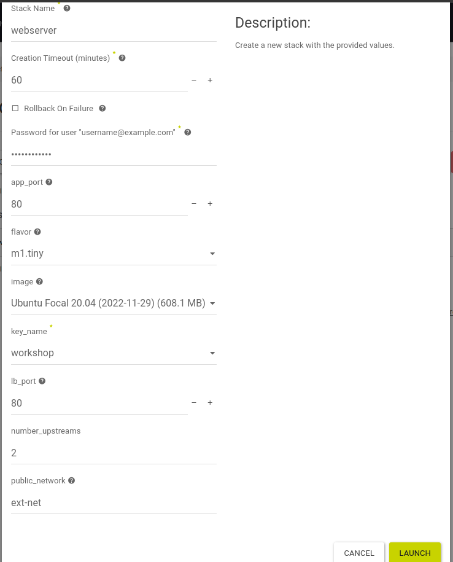
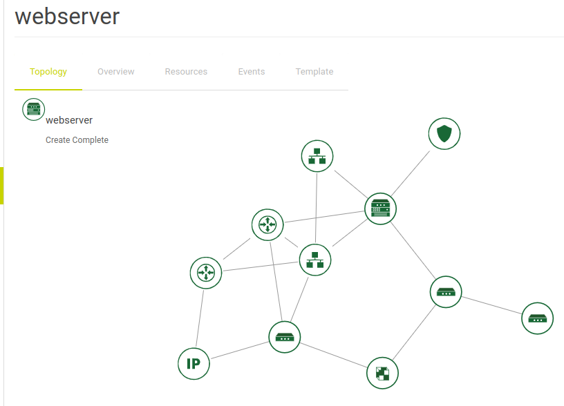
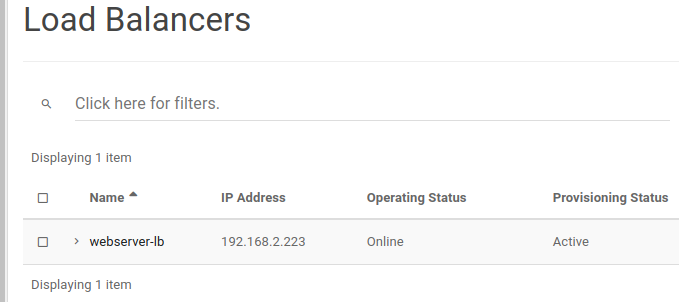
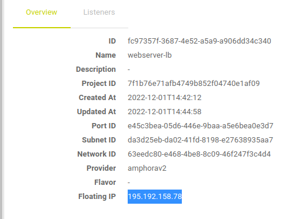

# Webserver mit Loadbalancer

## Übersicht

Mit dieser Anleitung kannst Du eine einfache Webapplikation über einen Loadbalancer veröffentlichen.

## Ziel

* erstelle zwei Webserver mit einer einfachen Web-Applikation
* die Applikation soll hinter einem Loadbalancer unter einer öffentlichen IP erreichbar sein

## Vorbereitung

* Du brauchst die Login Daten für Openstack
  * Benutzername
  * Passwort
  * Project ID
  * Region Name
* grundlegende Kenntnisse zum Umgang mit einem Linux Terminal und SSH

---

### Login

* Rufe die URL https://cloud.syseleven.de im Browser auf

* melde dich mit deinen Zugangsdaten an
  * Domain: `default`
  * User Name: `<Benutzername>`
  * Password: `<Passwort>`
* Klick auf "CONNECT"

### Region auswählen

* Überprüfe zunächst in welcher Region Du angemeldet bist und wechsle ggf. auf die richtige Region

### Heat Stack starten

* Klicke auf "Project" --> "Orchestration" --> "Stacks" um den Beispiel-Stack in Horizon zu erstellen
* Klick auf "Launch Stack"

---

* Wähle `URL` als **Template Source** aus
* Kopiere die URL des Beispiel-Stacks `https://raw.githubusercontent.com/syseleven/openstack-workshop-lab/main/06-lbaas/lbstack.yaml`
* und füge sie in das Feld **Template URL** ein
* Wähle `File` als **Environment Source**
* Klick auf **NEXT**

---

* trage in das Feld **Stack Name** den Namen `webserver` ein
* bearbeite nun die folgenden Eingabefelder:
* trage dein Openstack Passwort in das Feld **Password for user...** ein
* wähle als **flavor** `m1.tiny`
* wähle als **image** ein beliebiges `Ubuntu Focal 20.04 ...` Image aus
* wähle für **key_name** den vorhandenen Workshop SSH Key aus und
* klicke abschließend auf dne Button **LAUNCH**

---

### Aufbau des Loadbalancer Stacks

Der Heat Stack bestehend aus Loadbalancer und Webservern wird nun erstellt
und der Fortschritt kann mit klick auf den Stack-Namen beobachtet werden

---

---

Sobald alle Komponenten grün dargestellt werden, können diese angezeigt werden

* so z.B. auch die beiden Webserver-Instances unter **Compute** --> **Instances**
* diese sind mit `upstream0` und `upstream1` benannt

---

Der Loadbalancer wurde ebenfalls erstellt und kann unter **Network** --> **Octavia Load Balancers** angezeigt werden

* Klick auf den Namen des Loadbalancers um dessen öffentliche IP zu sehen
* darunter ist die Demo-Applikation nun im Browser erreichbar
* teste dies indem du sie aufrufst: `http://<Loadbalancer-IP>`

---

#### Ziel

* lade die aufgerufene Website im Browser neu
* der Inhalt der Website sollte den Hostnamen des jeweiligen Webservers ausgeben und diesen wechseln

`upstream0` -> `upstream1` und so weiter...

---

#### Weitere Aufgaben

Der Loadbalancer selbst enthält mehrere Sub-Komponenten

* Listener
* Pools
* Health Monitors
* Members

* lasse sie in Horizon anzeigen und prüfe ob diese alle im Status `online` sind
